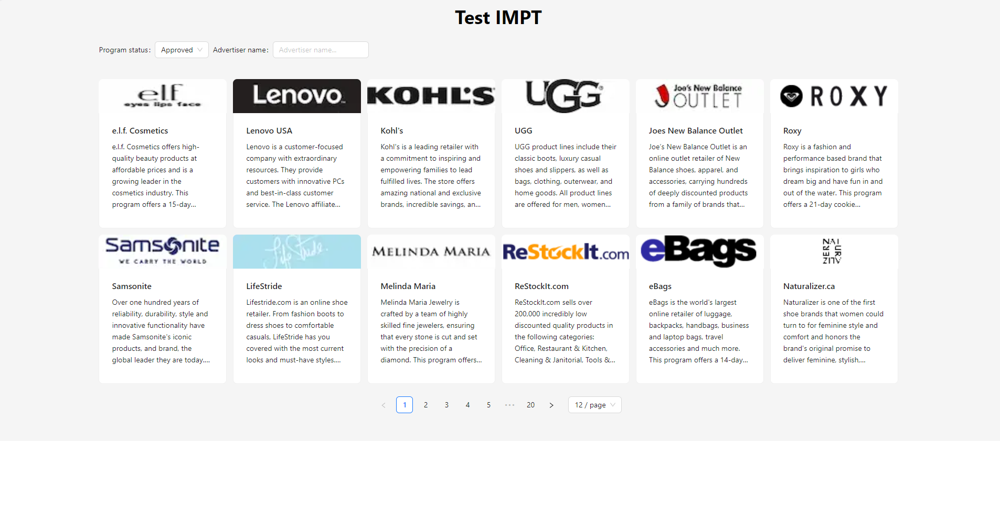

This project's techstack is [next:13.4.12](https://nextjs.org/), [eact:18.2.0](https://react.dev) with [typescript:4.9.5](https://www.typescriptlang.org/).

- API Service: [axios:1.2.0](https://axios-http.com/) and [@tanstack/react-query:5.36.0](https://tanstack.com/query/v5/docs/framework/react/overview)
- UI Library: [antd:5.17.2](https://ant.design/), [tailwindcss:3.4.3](https://tailwindcss.com/)

## Getting Started

Firstly, rename `.env.example` into `.env` then update enviroment variables file: `.env`

```bash
NEXT_PUBLIC_API_URL=
NEXT_PUBLIC_API_KEY=
```

Secondly, open your terminal and run 
```bash
npm i -g yarn

yarn

yarn dev
```

Thirdly, open your browser at `http://localhost:3000` to test the response of the api.

## Feature

Main screen: using api `{API_URL}/advertisers` to get all advertisers with request params

```bash
{
    page?: number,
    pageSize?: number,
    ProgramStatus: "Approved" | "Deactivated",
    name: string \* advertiser name *\
}
```

## RESEARCH FLEXOFFERS APIs

1. Not working:
    - ENDPOINT: /allSales
        - Response: 204 - No Content

    - ENDPOINT: /payments/summary
        - Response: 204 - No Content
2. Working
    - ENDPOINT: /products/catalogs
        - Response: List catalogs of advertiser

    - ENDPOINT: /products
        - Response: ProductShort[]
        ```typescript
        type ProductShort {
            pid: string,
            name: string,
            brand: string
        }
        ```

    - ENDPOINT: /products/long
        - Response: `ProductLong[]`
        ```typescript
        type ProductLong {
            pid: string,
            name: string,
            brand: string,
            cid: string,
            catalogName: string,
            aid: number,
            advertiserName: string,
            advertiserImage: string,
            advertiserCountry: string,
            linkUrl: string,
            shortDescription: string,
            description: string,
            categoryId: number,
            category: Category[],
            imageUrl: string,
            price: number,
            priceCurrency: string,
            salePrice: number,
            finalPrice: number,
            discount: null,
            isOnSale: boolean,
            isInstock: boolean,
            keywords: null,
            manufacturer: string,
            upCorEAN: string,
            mpn: string,
            sku: string,
            color: null,
            gender: male | female,
            size: null,
            condition: null,
            deepLinkURL: string,
            statusId: number
        }
        ```

    - ENDPOINT: /products/product
        - Response: `ProductLong`
    
    - ENDPOINT: /promotions
        - Response: Link[]
        ```typescript
        type Link {
            advertiserId: number,
            advertiserName: string,
            linkId: string,
            linkType: string,
            linkName: string,
            linkDescription: string,
            promotionalTypes: string,
            linkUrl: string,
            couponCode: string,
            couponRestrictions: string,
            startDate: DateTime,
            endDate: DateTime,
            imageUrl: string,
            bannerWidth: string,
            bannerHeight: string,
            htmlCode: string,
            allowsDeeplinking: boolean,
            categories: string,
            epc7D: number (The $USD earnings per 1,000 clicks averaged over 7 days),
            epc3M: number (The $USD earnings per 1,000 clicks averaged over 3 months),
            percentageOff: number,
            dollarOff: number,
            logoURL: string
        }
        ```

## Example screenshot




    